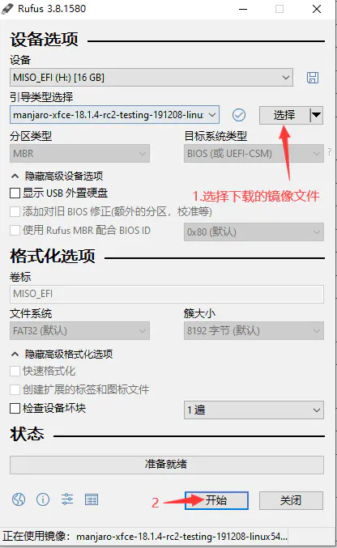
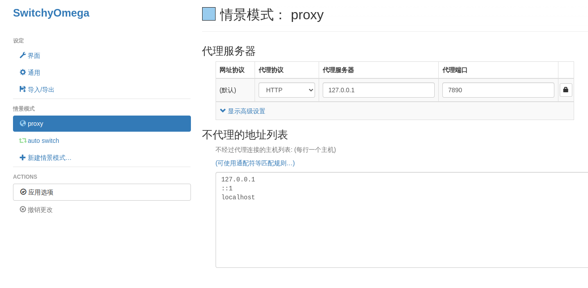
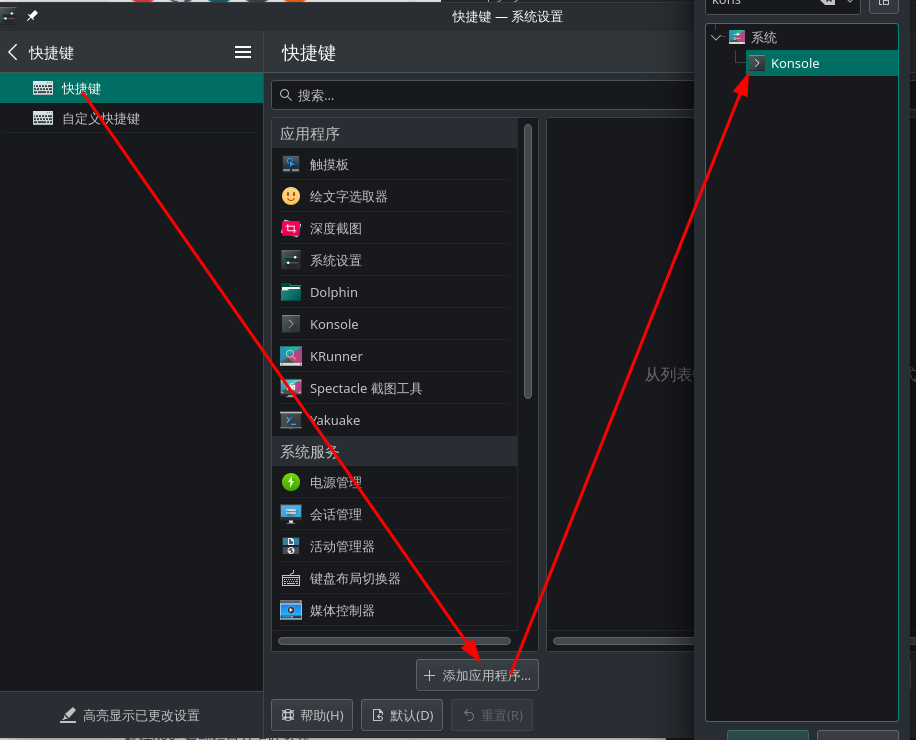
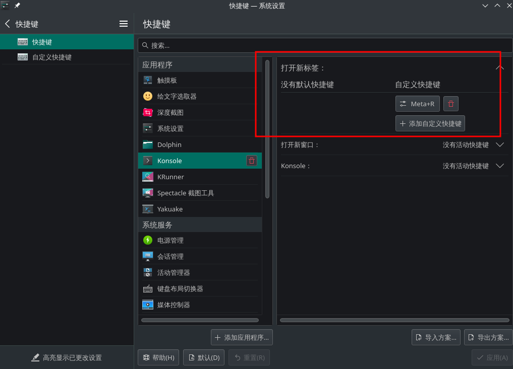
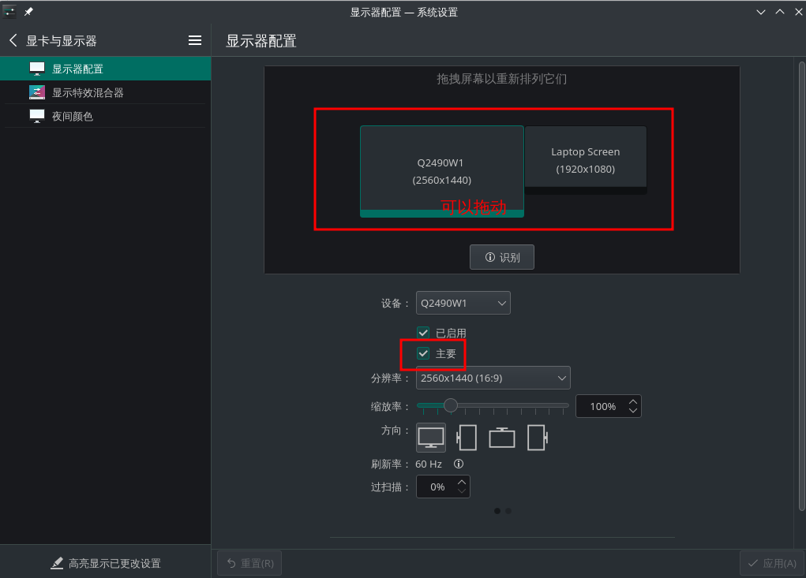

# easy-manjaro
> 从零构建一个基于manjaro linux的桌面开发环境，因本人从事java开发，下面需要的工具大多为java开发需要的，其他软件可自行在aur仓库中搜索安装。

<!-- vscode-markdown-toc -->
* 1. [介绍](#)
* 2. [系统安装](#-1)
	* 2.1. [系统版制作](#-1)
	* 2.2. [系统安装](#-1)
* 3. [包管理器及配置](#-1)
	* 3.1. [pacman](#pacman)
	* 3.2. [yay](#yay)
* 4. [常用软件安装](#-1)
	* 4.1. [中文输入法](#-1)
	* 4.2. [开发环境安装](#-1)
		* 4.2.1. [JDK安装](#JDK)
		* 4.2.2. [go语言环境](#go)
		* 4.2.3. [ python](#python)
		* 4.2.4. [nodejs](#nodejs)
		* 4.2.5. [npm](#npm)
	* 4.3. [构建工具](#-1)
		* 4.3.1. [maven](#maven)
		* 4.3.2. [gradle](#gradle)
		* 4.3.3. [ant](#ant)
	* 4.4. [浏览器及科学上网配置](#-1)
		* 4.4.1. [安装chrome](#chrome)
		* 4.4.2. [科学上网](#-1)
	* 4.5. [安装集成开发环境(IDE)](#IDE)
		* 4.5.1. [安装jetbrains全家桶](#jetbrains)
		* 4.5.2. [安装vscode](#vscode)
	* 4.6. [常用工具](#-1)
		* 4.6.1. [版本控制](#-1)
		* 4.6.2. [终端 (oh-my-zsh)](#oh-my-zsh)
		* 4.6.3. [文本编辑软件](#-1)
		* 4.6.4. [通讯软件](#-1)
		* 4.6.5. [截图工具](#-1)
	* 4.7. [测试调试工具](#-1)
		* 4.7.1. [postman](#postman)
		* 4.7.2. [jemeter](#jemeter)
		* 4.7.3. [arthas](#arthas)
		* 4.7.4. [apipost](#apipost)
	* 4.8. [抓包工具](#-1)
		* 4.8.1. [wireshark](#wireshark)
		* 4.8.2. [使用wireshark出现权限不足的问题](#wireshark-1)
	* 4.9. [远程控制](#-1)
		* 4.9.1. [finalshell](#finalshell)
		* 4.9.2. [termius](#termius)
		* 4.9.3. [sshpass](#sshpass)
		* 4.9.4. [ FileZilla](#FileZilla)
		* 4.9.5. [toDesk](#toDesk)
		* 4.9.6. [安装远程工具remmina及链接windows插件](#remminawindows)
	* 4.10. [安装虚拟机](#-1)
		* 4.10.1. [virtualbox](#virtualbox)
	* 4.11. [WPS](#WPS)
	* 4.12. [思维导图](#-1)
		* 4.12.1. [xmind](#xmind)
	* 4.13. [Docker](#Docker)
		* 4.13.1. [Docker](#Docker-1)
		* 4.13.2. [docker-compose](#docker-compose)
	* 4.14. [娱乐软件](#-1)
		* 4.14.1. [网抑云音乐](#-1)
* 5. [系统设置](#-1)
	* 5.1. [快捷键设置](#-1)
		* 5.1.1. [设置方式](#-1)
* 6. [美化](#-1)
* 7. [常见问题及解决办法](#-1)
	* 7.1. [如何外接显示器问题](#-1)
	* 7.2. [修改默认程序](#-1)
	* 7.3. [无法提交处理 (无效或已损坏的软件包)](#-1)
* 8. [资源地址](#-1)

<!-- vscode-markdown-toc-config
	numbering=true
	autoSave=true
	/vscode-markdown-toc-config -->
<!-- /vscode-markdown-toc -->


* 1. [介绍](#)
* 2. [系统安装](#-1)
  * 2.1. [系统版制作](#-1)
  * 2.2. [系统安装](#-1)
* 3. [包管理器及配置](#-1)
  * 3.1. [pacman](#pacman)
  * 3.2. [yay](#yay)
* 4. [常用软件安装](#-1)
  * 4.1. [中文输入法](#-1)
  * 4.2. [开发环境安装](#-1)
    * 4.2.1. [JDK安装](#JDK)
    * 4.2.2. [go语言环境](#go)
    * 4.2.3. [ python](#python)
    * 4.2.4. [nodejs](#nodejs)
    * 4.2.5. [npm](#npm)
  * 4.3. [构建工具](#-1)
    * 4.3.1. [maven](#maven)
    * 4.3.2. [gradle](#gradle)
    * 4.3.3. [ant](#ant)
  * 4.4. [浏览器及科学上网配置](#-1)
    * 4.4.1. [安装chrome](#chrome)
    * 4.4.2. [科学上网](#-1)
  * 4.5. [安装集成开发环境(IDE)](#IDE)
    * 4.5.1. [安装jetbrains全家桶](#jetbrains)
    * 4.5.2. [安装vscode](#vscode)
  * 4.6. [常用工具](#-1)
    * 4.6.1. [版本控制](#-1)
    * 4.6.2. [终端 (oh-my-zsh)](#oh-my-zsh)
    * 4.6.3. [文本编辑软件](#-1)
    * 4.6.4. [通讯软件](#-1)
    * 4.6.5. [截图工具](#-1)
  * 4.7. [测试调试工具](#-1)
    * 4.7.1. [postman](#postman)
    * 4.7.2. [jemeter](#jemeter)
    * 4.7.3. [arthas](#arthas)
    * 4.7.4. [apipost](#apipost)
  * 4.8. [抓包工具](#-1)
    * 4.8.1. [wireshark](#wireshark)
    * 4.8.2. [使用wireshark出现权限不足的问题](#wireshark-1)
  * 4.9. [远程控制](#-1)
    * 4.9.1. [finalshell](#finalshell)
    * 4.9.2. [termius](#termius)
    * 4.9.3. [sshpass](#sshpass)
    * 4.9.4. [ FileZilla](#FileZilla)
    * 4.9.5. [toDesk](#toDesk)
    * 4.9.6. [安装远程工具remmina及链接windows插件](#remminawindows)
  * 4.10. [安装虚拟机](#-1)
    * 4.10.1. [virtualbox](#virtualbox)
  * 4.11. [WPS](#WPS)
  * 4.12. [思维导图](#-1)
    * 4.12.1. [xmind](#xmind)
  * 4.13. [Docker](#Docker)
    * 4.13.1. [Docker](#Docker-1)
    * 4.13.2. [docker-compose](#docker-compose)
  * 4.14. [娱乐软件](#-1)
    * 4.14.1. [网抑云音乐](#-1)
* 5. [系统设置](#-1)
  * 5.1. [快捷键设置](#-1)
    * 5.1.1. [设置方式](#-1)
* 6. [美化](#-1)
* 7. [常见问题及解决办法](#-1)
  * 7.1. [如何外接显示器问题](#-1)
  * 7.2. [修改默认程序](#-1)

##  1. <a name=''></a>介绍

Manjaro基于Arch Linux，继承了Arch Linux滚动更新的特点，可以直接使用AUR上最齐全的软件。

针对ArchLinux的“硬伤”、对新手不友好的“弱点”，Manjaro采用了图形化安装程序，使安装过程非常轻松、人性化，同时也把安装ArchLinux后的大量繁琐工作——安装配置显卡驱动、AUR、X服务、桌面环境、中文输入法、Flash插件、音频解码器、显示管理器等——全都做到位了，为新手解决了大麻烦，为高级用户节省了大量时间。

具体来说，Manjaro在用户友好性上做了如下改进：

- 简单、用户友好的图形化安装程序
- 自动检测计算机的硬件（例如显卡）
- 为系统自动安装必要的软件（例如图形驱动程序）
- 它自己的专用软件仓库，以确保提供完全测试过的稳定的软件包
- 支持轻松安装和使用多个内核。
- 预安装桌面环境
- 独家开发的pamac软件管理器，轻松安装软件和更新您的系统
- 预安装编解码器播放多媒体文件

所以，在全球知名的DistroWatch网站，[Manjaro的排名一直稳步快速上升](http://distrowatch.com/table.php?distribution=manjaro)，短短几年迅速成长为最受欢迎的Linux发行版之一，直逼老牌发行版OpenSuse和Debian。可以说，像Arch这样优秀的Linux系统，如果解决了易用性的大问题，想不成为数一数二的Linux发行版都难！

##  2. <a name='-1'></a>系统安装

KDE桌面环境符合windows的操作习惯，这里以Manjaro KDE为例。

###  2.1. <a name='-1'></a>系统版制作

manjaro的系统盘推荐使用rufus，从官方下载系统镜像后，使用rufus制作系统系统盘。



###  2.2. <a name='-1'></a>系统安装

略

##  3. <a name='-1'></a>包管理器及配置

###  3.1. <a name='pacman'></a>pacman

**Pacman** 包管理器是 [Arch Linux](https://baike.baidu.com/item/Arch Linux/8876099)的一大亮点。它将一个简单的二进制包格式和易用的构建系统结合了起来。不管软件包是来自官方的 Arch 库还是用户自己创建，Pacman 都能方便的管理。

Pacman 通过和主服务器同步软件包列表来进行系统更新，这使得注重安全的系统管理员的维护工作成为轻而易举的事情。这种服务器/客户端模式可以使用一条命令就下载/安装软件包，同时安装必需的依赖包。

- 添加源

配置中国的 mirrors，在 终端 执行下面的命令从官方的源列表中对中国源进行测速和设置：

```
sudo pacman-mirrors -g  # 排列源，可不执行
sudo pacman-mirrors -i -c China -m rank # 更改源，在跳出的对话框里选择想要的源
```

为 Manjaro 增加中文社区的源来加速安装软件，在 /etc/pacman.conf 中添加 archlinuxcn 源，末尾加上：

只能添加一个，建议官方源

```
[archlinuxcn]
SigLevel = Optional TrustAll
#清华大学
Server = https://mirrors.tuna.tsinghua.edu.cn/archlinuxcn/$arch
```

安装 archlinuxcn-keyring 包以导入 GPG key，否则的话 key 验证失败会无法安装：

```shell
sudo pacman -Sy archlinuxcn-keyring
# 如果更新key时报错：本地时钟问题，可参考(https://blog.csdn.net/weixin_35436966/article/details/121132286)
# 同步并更新系统：
sudo pacman -Syyu
```

- 常用命令

```shell
sudo pacman -S 软件名　# 安装
sudo pacman -R 软件名　# 删除单个软件包，保留其全部已经安装的依赖关系
sudo pacman -Rs 软件名 # 除指定软件包，及其所有没有被其他已安装软件包使用的依赖关系
sudo pacman -Ss 软件名  # 查找软件
sudo pacman -Sc # 清空并且下载新数据
sudo pacman -Syu　# 升级所有软件包
sudo pacman -Qs # 搜索已安装的包
```

###  3.2. <a name='yay'></a>yay

> Yay 是用 Go 编写的 Arch Linux AUR 包管理工具。

- 安装

```
sudo pacman -S yay
```

- 配置aur源

```shell
# 注意：清华的aur源(https://aur.tuna.tsinghua.edu.cn)移除了，如果使用可能会有问题，这里使用官方的源。
yay --aururl "https://aur.archlinux.org" --save
```

- 修改的配置文件位于 `~/.config/yay/config.json` ，还可通过以下命令查看修改过的配置:

```
yay -P -g
```

- 常用命令

```
yay -S package # 从 AUR 安装软件包
yay -Rns package # 删除包
yay -Syu # 升级所有已安装的包
yay -Ps # 打印系统统计信息
yay -Qi package # 检查安装的版本
```

***注意：yay需要在普通用户下使用，不用加`sudo`***

##  4. <a name='-1'></a>常用软件安装

###  4.1. <a name='-1'></a>中文输入法

因为Fcitx4有很多bug，中文输入法推荐使用fcitx5。[官方wiki](https://wiki.archlinux.org/title/Fcitx5_(%E7%AE%80%E4%BD%93%E4%B8%AD%E6%96%87))

- 卸载fcitx4（如果已安装）

```shell
sudo pacman -Rscn fcitx-im fcitx-configtool fcitx-googlepinyin
#删除软件包、无用依赖及配置文件
sudo rm ~/.xprofile
#删除环境变量
```

- 安装

```
sudo pacman -S fcitx5-im fcitx5-chinese-addons fcitx5-qt fcitx5-gtk
#安装 Fcitx5主体、配置工具、输入法引擎及中文输入法模块
sudo vim ~/.pam_environment
#加入以下内容（中间是一个 Tab键）
GTK_IM_MODULE DEFAULT=fcitx
QT_IM_MODULE  DEFAULT=fcitx
XMODIFIERS    DEFAULT=\@im=fcitx
```

注销或者重启系统。

- 安装词库

```
#安装中文维基百科词库,更多词库请参考官方wiki页面
sudo pacman -S fcitx5-pinyin-zhwiki
```

- 安装主题

> sudo pacman -S fcitx5-nord

安装后，打开 Fcitx5配置 -> 配置附加组件 -> 经典用户界面设置 -> 在“主题”栏中选择主题即可 


###  4.2. <a name='-1'></a>开发环境安装

####  4.2.1. <a name='JDK'></a>JDK安装

JDK的安装方式很多，大概有如下几种：

1. 通过JDK官方下载的包，解压、配置环境变量

2. 通过pacman、yay包管理器安装

3. 通过archlinux-java管理jdk

4. 通过sdkman管理

根据笔者在实际使用中的经验，在使用过程中会涉及到jdk版本的切换，如果直接通过1的方式不是很方便，笔者推荐2（安装）+3（管理）的方式。本文以`archlinux-java`命令来进行管理。当然`sdkman`同样非常强大，不仅可以管理java版本，同样也可以管理gradle、maven、node等。

##### pacman安装

目前应用最广泛的是jdk8，有一些软件要求jdk17(dbeaver等)，这里将这两个版本都安装

```shell
sudo pacman -S jdk8-openjdk
sudo pacman -S java-17-openjdk
```

##### archlinux-java

命令用法如下：

```
archlinux-java <COMMAND>

COMMAND:
        status          List installed Java environments and enabled one
        get             Return the short name of the Java environment set as default
        set <JAVA_ENV>  Force <JAVA_ENV> as default
        unset           Unset current default Java environment
        fix             Fix an invalid/broken default Java environment configuration
```

- 使用`archlinux-java status`列出以安装的jdk

```
Available Java environments:
  java-17-openjdk (default)
  java-8-openjdk
```

默认使用了17,可以版本切换，执行:

```
$ sudo archlinux-java set java-8-openjdk                                               
$ java -version    
# 版本进行了切换
openjdk version "1.8.0_332"
OpenJDK Runtime Environment (build 1.8.0_332-b04)
OpenJDK 64-Bit Server VM (build 25.332-b04, mixed mode)
```

##### sdkman安装

sdkman的安装方式参考：[官方文档](https://sdkman.io/)

####  4.2.2. <a name='go'></a>go语言环境

```
$ sudo pacman -S goland
```

####  4.2.3. <a name='python'></a> python

> python环境linux都自带了

 略

####  4.2.4. <a name='nodejs'></a>nodejs

node的推荐使用nvm来进行管理，很方便管理不同版本的node环境

- 安装

```
$ curl -o- https://raw.githubusercontent.com/nvm-sh/nvm/v0.34.0/install.sh | bash
```

重新打开一个终端，输入`nvm`当出现命令说明时即证明安装完成。

- 使用

```
# 列出可用版本
$ nvm ls-remote
# 安装制定版本
$ nvm install v17.7.2（上一条命令查出的版本号）
# 列出本地已经安装的版本号
$ nvm ls
# 使用制定版本
$ nvm use v17.7.2
```

####  4.2.5. <a name='npm'></a>npm

```
$ sudo pacman -S npm
```

###  4.3. <a name='-1'></a>构建工具

####  4.3.1. <a name='maven'></a>maven

[官方网站](https://maven.apache.org/)

[超级详细的Maven使用教程](https://blog.csdn.net/lovequanquqn/article/details/81627807)

```
$ sudo pacman -S maven
```

####  4.3.2. <a name='gradle'></a>gradle

[官方网站](https://gradle.org/)

```
$ sudo pacman -S gradle
```

####  4.3.3. <a name='ant'></a>ant

```
$ sudo pacman -S ant
# 基本已经不用了，可装可不装
```


###  4.4. <a name='-1'></a>浏览器及科学上网配置

####  4.4.1. <a name='chrome'></a>安装chrome

manjaro自带了firefox。但是对于开发者更倾向于chrome。

- 安装google-chrome

```
$ sudo pacman -S google-chrome
```

在manjaro 2021.2.4时发现安装完成后在启动面板里找不到图标。这种情况可以在终端中输入

```
$ google-chrome-stable
```

即可打开浏览器。后续可以在启动面板中找到图标来启动。

####  4.4.2. <a name='-1'></a>科学上网

- 安装clash命令行客户端

根据[官方配置文档](https://github.com/Dreamacro/clash/wiki/configuration)，将代理服务配置为config.yaml，并保存在~/.config/clash/config.yaml中

```
# 安装依赖
$ sudo yum install curl wget jq
# 下载并安装客户端
$ rm -f clash* && curl -LO $(curl -ksL "https://api.github.com/repos/Dreamacro/clash/releases/latest" | jq -c '.assets[] | select( .name | contains("clash-linux-amd64"))' | jq -r ".browser_download_url") && gzip -d clash* && mv clash* clash && chmod +x clash && sudo mv clash /usr/local/bin
# 启动
$ clash
```

在首次启动时，将会下载IP地域库文件。该过程可能需要5-10分钟。待启动成功后执行

```
$ curl www.google.com -x 127.0.0.0:7890
```

如果有返回证明执行成功。

- 安装SwitchyOmega插件

在https://crxdl.com/中搜索`SwitchyOmega`，下载最新版。然后在chrome->更多工具->扩展程序->勾选开发者模式->将下载的crx文件拖拽到chrome中即可完成安装。

- SwitchyOmega默认提供了两个情景模式，一般这两种情况就够用了，下面是配置截图：

  > 规则列表地址为：https://raw.githubusercontent.com/agate/gfwlist/master/dist/gfwlist.txt




配置完成后，在switchyomega中切换proxy模式，即可科学上网。

###  4.5. <a name='IDE'></a>安装集成开发环境(IDE)

####  4.5.1. <a name='jetbrains'></a>安装jetbrains全家桶

- 安装`jetbrain-toolbox`

```
sudo pacman -S jetbrains-toolbox
```

- 然后即可通过toolbox安装其他IDE

####  4.5.2. <a name='vscode'></a>安装vscode

```
yay -S visual-studio-code-bin
```


###  4.6. <a name='-1'></a>常用工具

####  4.6.1. <a name='-1'></a>版本控制

##### svn

````
$ sudo pacman -S svn
````

##### git

> 系统自带

- 配置

```
$ git config --global user.name "John Doe"
$ git config --global user.email johndoe@example.com
#代理配置,科学上网可加快github代码下载速度
$ git config --global https.proxy http://127.0.0.1:7890
$ git config --global https.proxy https://127.0.0.1:7890
```

####  4.6.2. <a name='oh-my-zsh'></a>终端 (oh-my-zsh)

[官方网站](https://ohmyz.sh/)

- 安装

```
$ sh -c "$(curl -fsSL https://raw.github.com/ohmyzsh/ohmyzsh/master/tools/install.sh)"
```

如果curl速度过慢或无法访问，可使用curl代理

```
$ sh -c "$(curl -x 127.0.0.1:7890 -fsSL https://raw.github.com/ohmyzsh/ohmyzsh/master/tools/install.sh)"
```

- 插件安装
  - [oh-my-zsh插件推荐](https://www.jianshu.com/p/9189eac3e52d)

```
网络命令
$ sudo pacman -S net-tools
```


####  4.6.3. <a name='-1'></a>文本编辑软件

##### markdown

- typora

```
$ sudo pacman -S typora
```

因为typora收费了，可能有些同学比较反感。推荐另一款开源、且风格相似的markdown编辑器

- marktext

```
$ yay -S marktext
```

- 自带的kate也很好用

####  4.6.4. <a name='-1'></a>通讯软件

安装微信和QQ需要的wine环境

```
sudo pacman -S base-devel 
sudo pacman -S wine-mono
```

##### 微信

```
yay -S deepin-wine-wechat
```

##### QQ

```]
yay -S deepin-wine-tim	
```

##### 腾讯会议

```
yay -S wemeet-bin	
```

##### Zoom

```
yay -S zoom
```

####  4.6.5. <a name='-1'></a>截图工具

##### 深度截图工具

```
sudo pacman -S deepin-screenshot
```

##### flameshot（火焰截图）

linux上非常强大的截图，强烈推荐。

```
sudo pacman -S flameshot
```

###  4.7. <a name='-1'></a>测试调试工具

####  4.7.1. <a name='postman'></a>postman

````
sudo pacman -S postman-bin
````

####  4.7.2. <a name='jemeter'></a>jemeter

```
yay -S jmeter
```

####  4.7.3. <a name='arthas'></a>arthas

```
yay -S arthas
```

####  4.7.4. <a name='apipost'></a>apipost

```
yay -S apipost
```

###  4.8. <a name='-1'></a>抓包工具

####  4.8.1. <a name='wireshark'></a>wireshark

```
sudo pacman -S wireshark-qt
# 配合tcpdump抓宝使用
sudo pacman -S tcpdump
```

####  4.8.2. <a name='wireshark-1'></a>使用wireshark出现权限不足的问题

使用wireshark出现Couldn’t run /usr/bin/dumpcap in child process: Permission denied解决办法

```
sudo chgrp myusername /usr/bin/dumpcap  # myusername是你使用wireshark的当前用户名
sudo chmod 750 /usr/bin/dumpcap
sudo setcap cap_net_raw,cap_net_admin+eip /usr/bin/dumpcap
```

###  4.9. <a name='-1'></a>远程控制

####  4.9.1. <a name='finalshell'></a>finalshell

```
yay -S finalshell
```

####  4.9.2. <a name='termius'></a>termius

```
yay -S termius
```

####  4.9.3. <a name='sshpass'></a>sshpass

上面两个是工具软件，sshpass是命令行工具

```
sudo pacman -S sshpass
```

####  4.9.4. <a name='FileZilla'></a> FileZilla

服务器上传下载工具

```
sudo pacman -S filezilla
```

####  4.9.5. <a name='toDesk'></a>toDesk

最近很火的远程控制软件，所有平台可用，且不限速是向日葵、teamweaver的替代方案。

```
yay -S todesk
```

####  4.9.6. <a name='remminawindows'></a>安装远程工具remmina及链接windows插件

```
sudo pacman -S remmina
yay -S remmina-plugin-rdesktop
```


###  4.10. <a name='-1'></a>安装虚拟机

####  4.10.1. <a name='virtualbox'></a>virtualbox

linux下肯定是virtualbox 了

```
sudo pacman -S virtualbox
```

如果在使用过程中报错，一般是由于缺少linux-header引起的

```
sudo pacman -S linux<内核版本>-virtualbox-host-modules
sudo pacman -S linux<内核版本> linux<内核版本>-headers
```

将内核版本替换成实际的即可，如

```
sudo pacman -S linux512-virtualbox-host-modules
sudo pacman -S linux512 linux512-headers
```

###  4.11. <a name='WPS'></a>WPS

```
yay -S wps-office wps-office-mui-zh-cn ttf-wps-fonts
```

###  4.12. <a name='-1'></a>思维导图

####  4.12.1. <a name='xmind'></a>xmind

````
yay -S xmind-zen
````

也可以安装另一个版本

```
yay -S xmind
```

###  4.13. <a name='Docker'></a>Docker

####  4.13.1. <a name='Docker-1'></a>Docker

- 安装

```
sudo pacman -S docker
# 启动docker
sudo systemctl start docker
```

- 普通用户使用docker

```
#将登陆用户加入到docker用户组中
sudo gpasswd -a $USER docker   
#更新用户组
newgrp docker     
#更新下权限
sudo chmod 666 /var/run/docker.sock
# 重启一下
sudo systemctl restart docker
```

####  4.13.2. <a name='docker-compose'></a>docker-compose

```
sudo pacman -S docker-compose
```

###  4.14. <a name='-1'></a>娱乐软件

####  4.14.1. <a name='-1'></a>网抑云音乐

```
$ sudo pacman -S netease-cloud-music vlc
```

##  5. <a name='-1'></a>系统设置

###  5.1. <a name='-1'></a>快捷键设置

####  5.1.1. <a name='-1'></a>设置方式

以konsole为例，通过win+R直接打开新窗口

1. 打开系统设置
2. 选择“快捷键”
3. 点击“添加应用程序”，在其中搜索"konsole"



4. 在打开新标签中设置快捷键。然后即可通过快捷键快速打开新窗口



##  6. <a name='-1'></a>美化

在“系统设置”->“外观”中自己选择喜欢的主题即可。

##  7. <a name='-1'></a>常见问题及解决办法

###  7.1. <a name='-1'></a>如何外接显示器问题

manjaro的驱动很强大，可以直接识别到外界的显示器。如果没有识别到切换写显卡方案到开源驱动试下。另外设置主显示器方式如下：  

1. 进入“系统设置”->”显卡与显示器“->“显示显示器配置”
2. 在右侧配置对应的显示器作为主显示器即可
3. 另外可以直接拖拽来排列显示器，注意两个显示器不要用重合的地方，不然会在多个显示器上有重复显示的内容。



###  7.2. <a name='-1'></a>修改默认程序

1. 进入“系统设置”->”搜索默认程序“
2. 修改对应的默认程序即可

###  7.3. <a name='-1'></a>无法提交处理 (无效或已损坏的软件包)
1.首先更新一下密钥，如果没有安装archlinux-keyring,请及时安装
```aidl
sudo pacman-key --refresh-keys
```
2.重新加载相应的签名密钥
```aidl
sudo pacman-key --init
sudo pacman-key --populate
```
3。清除pacman 的缓冲文件
```aidl
sudo pacman -Scc
```

4.更新或者安装系统即可
```aidl
sudo pacman -Syu
```


##  8. <a name='-1'></a>资源地址

- [manjaro官网](https://manjaro.org/)
- [arch仓库地址](https://aur.archlinux.org/)
- [极致linux](https://linuxacme.cn/)
- [Manjaro Linux 乐于简单](https://manjaro.org.cn/)